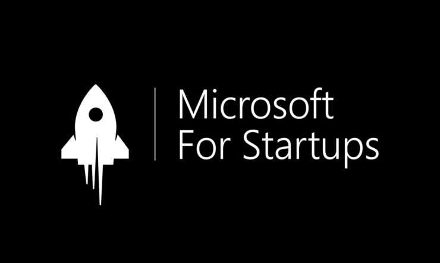

# Microsoft For Startups


<!-- PROJECT LOGO -->
<br />
<div align="center">
  <a href="https://github.com/github_username/repo_name">
    
  </a>

<h3 align="center">Building a startup on Microsoft Azure (S01E02)</h3>

  <p align="center">
    This repo contains all the work for Episode 2 of Nikhil Sehgal's series on building a startup on Microsoft Azure.
    <br />
    <br />
    <!-- <a href="https://nikhilsehgal123-zipit-main-zsarkz.streamlit.app/">View Demo</a> -->

  </p>
</div>

<!-- ABOUT THE PROJECT -->
## About The Project

<!-- [![Product Name Screen Shot][product-screenshot]](https://example.com) -->
***Products Used***
- ```Azure Anomaly Detector```


***Overview***
To view the presentation please [click here](https://www.canva.com/design/DAFTJG-ibKE/71-TowhwNY4Fi2Z2ZUx-Bw/view?utm_content=DAFTJG-ibKE&utm_campaign=designshare&utm_medium=link&utm_source=publishsharelink)

***Solution Brief***
Using Azure Anomaly Detector, we have built a solution that can spot anomalies in physiological data. Spotting anomalies in physiological data is important because it can be informative of signs of health deterioration. This can be used to detect early signs of disease and can be used to improve the quality of life of patients.

<!-- ***How it works***

 -->

<!-- Description of each script
## Description of each script

- ```main.py``` - This is the main script that runs the entire application.
- ```ms_graph_api.py``` - This script contains all the functions that interact with the Microsoft Graph API.
- ```azure_openai.py``` - This script contains all the functions that interact with the OpenAI API.
- ```.env``` - This file contains all the environment variables that are used in the application. (This file is not included in the repo for security reasons)* -->

*Your .env file should contain the following variables:*
```python
ANOMALY_DETECTOR_API_KEY=<YOUR API KEY>
ANOMALY_DETECTOR_ENDPOINT=<YOUR ENDPOINT>
```

<!-- GETTING STARTED -->
## Getting Started

To run the streamlit project locally, run the following CLI commands.

```python
pip install -r requirements.txt ## Install all the dependencies
python azure_anomoly_detector_entire.py ## Run the main application to detect anomalies
```

<!-- Resources -->
## Learning Resources

- [Azure Anomaly Detection Resource](https://azure.microsoft.com/en-gb/products/cognitive-services/anomaly-detector/#overview)

